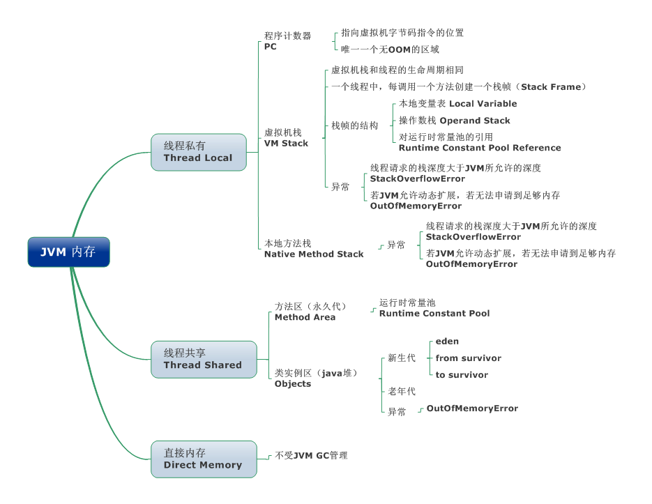

# JVM内存区域

> JVM内存区域主要分为**线程私有区域**：程序计数器、虚拟机栈、本地方法区；**线程共享区域**：堆、方法区

线程私有区域生命周期与线程相同，依赖用户线程的启动结束，每个线程都与操作系统的本地线程直接映射。

## 程序计数器

一块较少的内存空间，是当前线程所执行的字节码的**行号指示器**，每条线程都拥有一个独立的程序计数器，记录虚拟机字节码指令的地址，如果执行的Native方法的时候，则为空。
没有OOM情况的一块区域

## 虚拟机栈

Java方法执行的内存模型，每个方法执行的同时都会创建一个**栈帧**，用于**存储局部变量表、操作数栈、动态链接、方法出口等信息**。每个方法从调用到完成的过程，都对应着一个栈帧入栈到出栈的过程。

栈帧用来存储数据和部分结果的数据结构，同时用来处理动态链接、方法返回值和异常分派。栈帧随着方法调用而创建，随着方法结束而销毁-无论是正常完成还是抛出异常。

## 本地方法区

本地方法区和虚拟机栈类似，区别是虚拟机栈为执行Java方法服务，而本地方法栈为Native方法服务

## 堆 - 运行时数据区

是被线程共享的一块区域，创建的对象和数据都被保存在堆内存中，也是**垃圾回收**的最重要的一块内存区域。由于目前采用分代收集算法，因此Java堆从GC的角度还细分为：新生代和老年代。

## 方法区/永久代

永久代，用于存储**JVM加载的类信息、常量、静态变量、即时编译器编译后的代码**等数据。HotSpot VM把GC分代收集拓展至方法区，即使用Java堆的永久代来实现方法区，这样HotSpot的垃圾收集器就可以像管理Java堆一样管理这部分内存。不必为方法区专门开发内存管理器。永久代的内存回收的主要目标时针对常量池的回收和类型的卸载，一般收益会很小。
运行时常量池是方法区的一部分。Class文件中除了有类的版本、字段、方法、接口等描述信息外，还有一项信息是常量池，用来存放编译器生成的各种字面量和符号引用，这部分内容将在类加载后存放在方法区的运行是常量池中。Java虚拟机对class文件的每一部分的格式都有严格的规定，每个字节用于存储哪种数据都必须符合规范上的要求，这样才会被虚拟机认可、装载和执行。
